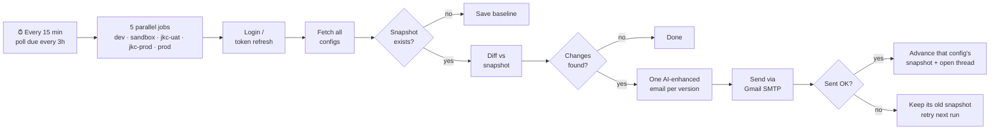
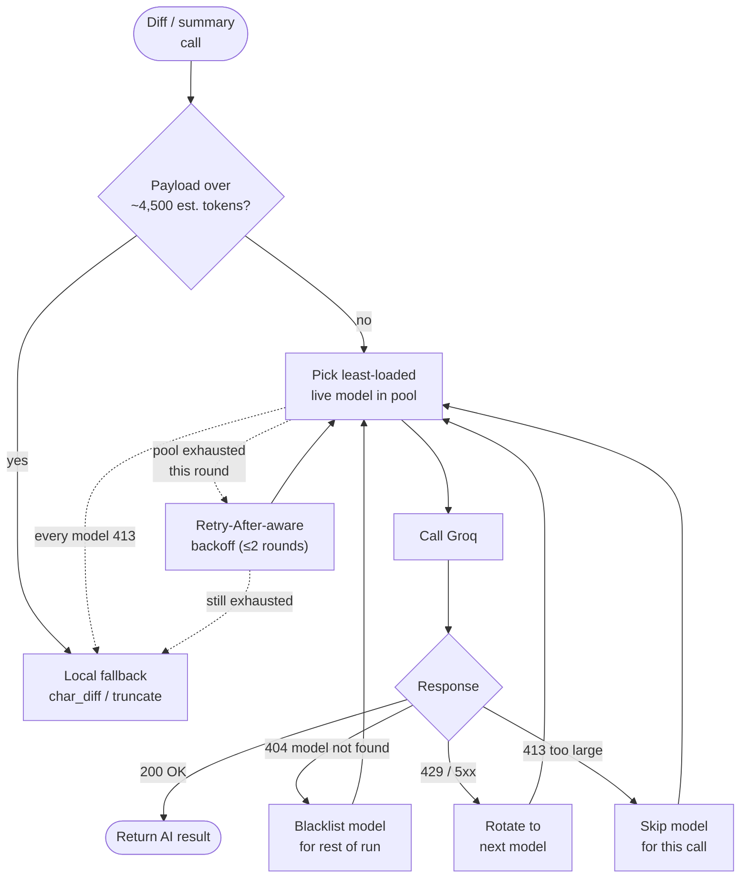
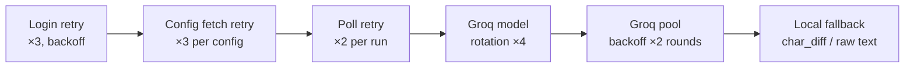
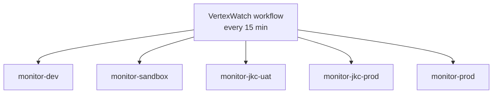
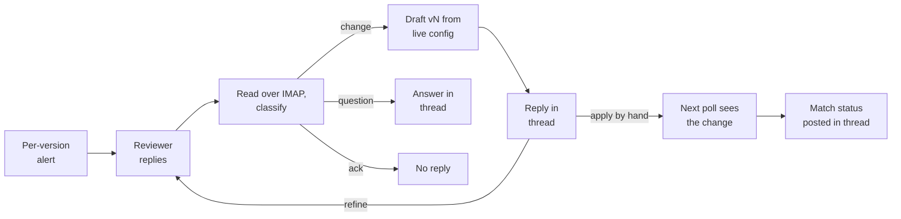

# VertexWatch

Real-time monitoring for Vertex AI OCR pipeline configurations, with AI-powered change summaries and reply-driven change drafts.

---

## Overview

VertexWatch polls Vertex AI OCR-config across **five** environments, detects configuration drift, and sends one human-readable email per changed config version. Reply to that email in plain language and VertexWatch drafts the exact edits back in the same thread, for a person to apply by hand:

| Environment | Backend | Auth secrets |
|---|---|---|
| `dev` | EKA API (dev) | `DEV_USERNAME`, `DEV_PASSWORD` |
| `sandbox` | EKA API (UAT sandbox) | `SANDBOX_USERNAME`, `SANDBOX_PASSWORD` |
| `jkc-uat` | JK Systems UAT | `JKC_USERNAME`, `JKC_UAT_PASSWORD` |
| `jkc-prod` | JK Systems Production | `JKC_USERNAME`, `JKC_PROD_PASSWORD` |
| `prod` | EKA Production (Heimdall) | `PROD_USERNAME`, `PROD_PASSWORD` |

A scheduled GitHub Actions workflow runs every 15 minutes: it always checks for replies and runs a full poll once 3 hours have passed since the last poll attempt. Each run fans out into **5 independent matrix jobs, one per environment, running in parallel** (a repo-wide concurrency group only prevents two *whole workflow runs* from overlapping — the jobs inside one run are not sequential).

When a change is detected, VertexWatch doesn't just dump a raw diff — it routes long text fields (`systemInstruction`, `userInstruction`) through a small pool of Groq-hosted LLMs to produce a semantic, highlighted diff plus a plain-English "what changed and why it matters" summary, with local fallbacks at every step so a flaky or rate-limited model never blocks an alert.



---

## Features

**Monitoring**
- 5-environment tracking (dev, sandbox, jkc-uat, jkc-prod, prod)
- Change detection (additions, modifications, deletions)
- Field-level change tracking, including nested `generationConfig`
- Snapshot caching per environment (each config only advances after its own email is sent)

**AI-Powered Analysis**
- Multi-model Groq dispatcher — spreads load across an interchangeable model pool instead of one hardcoded model
- Semantic, sentence/phrase-level highlighted diffs for long instruction fields
- Plain-English functional-impact summaries for `systemInstruction` changes
- Automatic local fallback (`char_diff`) if every model is unavailable — an alert never fails to send because of an LLM outage

**Alerting**
- One email per changed config version (subject: `[VertexWatch][ENV] Config #id | type | version | EVENT`)
- Extra one-line-per-version digest when a run finds more than 10 versions
- Email notifications via Gmail SMTP
- HTML formatted messages with color-coded before/after tables
- AI-generated operational-impact callout box
- Timestamp and metadata included

**Reply-driven drafts**
- Reply to an alert in plain language; VertexWatch replies in the same thread with a drafted change
- Back-and-forth refinement: every reply produces a numbered draft showing what changed from the last one
- Confirms in the thread when a later poll sees the draft applied (full or partial match)
- Never writes to any environment

**Reliability**
- Layered retries: login → config fetch → poll → Groq model rotation → Groq backoff → local fallback
- Comprehensive, non-sensitive error logging
- Token refresh with expiry-aware re-auth
- Concurrency-controlled workflow (no overlapping runs)

---

## AI-Powered Change Analysis

Three call sites use AI, all routed through a single `GroqDispatcher`:

| Function | Purpose | Payload cap before calling Groq |
|---|---|---|
| `ai_diff()` | Sentence/phrase-level highlighted diff of a changed text block | ~4,500 est. tokens per block |
| `generate_functional_summary()` | 2–3 sentence plain-English summary of a `systemInstruction` change | ~4,500 est. tokens (head+tail truncated) |
| `char_diff()` | Character-level local diff — the fallback for everything above, or when Groq is unreachable | n/a (always local) |

### Model pool & failover

The Free-tier Groq plan rate-limits a single model hard enough that a handful of changes in one poll used to trigger cascading `429`s. `GroqDispatcher` instead holds an ordered pool of independent text models — each with its **own** rate-limit bucket — and picks the least-loaded one for every call:



**Model pool** (each entry is a separate rate-limit bucket on Groq), read from the account's model list at the start of each run:
`llama-3.1-8b-instant` → `openai/gpt-oss-20b` → `qwen/qwen3-32b` → `openai/gpt-oss-120b` first (those the account still lists), then every other active text model it lists. Speech, safety-classifier and agent models are skipped. If the listing fails, the four built-in models are used.

Key behaviors:
- **Least-loaded routing** — picks the model with the fewest calls (then fewest tokens) made so far *this run*, not a fixed order.
- **Immediate failover on `429`/`5xx`** — no wasted delay, just rotates to the next live model in the same call.
- **Permanent 404 blacklisting** — if a model is decommissioned or not enabled on the account, it's dropped for the rest of the run instead of being retried on every subsequent call.
- **`413` skips that model for this call only** — larger models allow more tokens per minute, so the request moves on; once every model has returned 413 it falls back to local logic without backoff rounds.
- **Pool-exhaustion backoff** — if every live model fails in one round, backs off (`Retry-After`-aware, else exponential + jitter) for up to 2 more rounds before giving up.
- **Self-paced** — dispatch rounds are throttled to ~2 calls/sec so a burst of changed fields in one poll doesn't hammer the pool.

### Defense in depth

Every layer below degrades gracefully into the next rather than failing the whole run:



---

## Setup

### Prerequisites

- Python 3.11+
- GitHub repository with Actions enabled
- Gmail account with 2-Step Verification
- A Groq API key (free tier) for AI-powered summaries — optional; everything degrades to local diffs without it

### Secrets Configuration

Add these to GitHub Settings → Secrets and variables → Actions:

```
DEV_USERNAME        # Dev environment username
DEV_PASSWORD        # Dev environment password
SANDBOX_USERNAME    # Sandbox (UAT) environment username
SANDBOX_PASSWORD    # Sandbox (UAT) environment password
JKC_USERNAME        # JKC username (shared for UAT and Prod)
JKC_UAT_PASSWORD    # JKC-UAT specific password
JKC_PROD_PASSWORD   # JKC-PROD specific password
PROD_USERNAME       # Production username
PROD_PASSWORD       # Production password
GROQ_API_KEY        # Groq API key — enables AI diff/summary (optional)
GMAIL_USER          # Gmail address for alerts
GMAIL_APP_PASS      # Gmail App Password (16 characters)
ALERT_EMAIL         # Recipient email(s), comma-separated
```

### Gmail Setup

1. Go to Google Account → Security
2. Enable 2-Step Verification
3. Navigate to App passwords
4. Select Mail and Windows Computer
5. Copy the 16-character password
6. Add as GMAIL_APP_PASS secret

---

## Getting Started

### File Structure

```
.github/workflows/
    └── main.yml                  # GitHub Actions workflow (5-env matrix)
monitor.py                        # Monitoring, reply drafting + GroqDispatcher
requirements.txt                  # Dependencies
README.md                         # Documentation
```

### Running the Workflow

Each trigger spins up 5 matrix jobs **in parallel**, one per environment (schedule: see [Configuration](#configuration); a manual run always polls):



A repo-wide concurrency group (`vertexwatch-monitors`) blocks a *new* workflow run from starting while a previous one is still in progress — it does not serialize the jobs within a single run.

To run manually:

1. Go to Actions tab
2. Click VertexWatch workflow
3. Click "Run workflow"
4. Select branch and click "Run workflow"

### Viewing Results

**GitHub Actions Logs:**
1. Go to Actions tab
2. Click VertexWatch workflow
3. Click the run you want to check
4. Expand the job for the environment you care about

**Change Logs:**
1. Go to the workflow run page
2. Scroll to Artifacts section
3. Download the `logs-{environment}` artifact (contains `change_log_{environment}.json`)

---

## Configuration

**Workflow Schedule:**
```
Every 15 minutes (*/15 * * * *): reply check
Full poll: when 3 hours have passed since the last poll attempt, or on a manual run
A poll that never started (run replaced in the queue) happens on the next run
A failed poll is retried after the interval; replies are still read meanwhile
```

**Polling Strategy:**
```
Polls per run: 1 (with 1 retry on fetch failure)
Per-config fetch: up to 3 attempts with increasing backoff
Run duration: seconds to ~2 minutes, depending on how many
              fields changed and need AI summarization
```

**Timeout Settings:**
```
Login:              45 seconds
Token refresh:       30 seconds
Config fetch:        30 seconds (×3 attempts)
Groq summary call:   30 seconds (per model attempt)
Groq semantic diff:  45 seconds (per model attempt)
Email (SMTP):        30 seconds
```

**Data Retention:**
```
Change log retention: 500 latest entries per environment
Snapshot caching: Per-environment, each config updated only after its email is sent
Reply threads + last poll time: state_{environment}.json, threads dropped 14 days after the alert
State: two Actions caches per environment (snapshot + change log, reply state),
       saved even when a run fails; the snapshot only after a poll, the reply state only when it changed
```

---

## Monitored Fields

**Top-Level Configuration**
- version
- type
- locationId
- projectId
- apiEndPoint
- model
- systemInstruction
- userInstruction

**Generation Config**
- temperature
- maxOutputTokens
- topP
- seed
- thinkingConfig.thinkingBudget

---

## Email Alerts

Alert messages include:

- One config version per email, so every email is its own reply thread
- Environment name and label
- Configuration ID, type, and version
- Change event type (MODIFIED, ADDED, REMOVED)
- Field-by-field before/after values, with semantic highlighting for long instruction fields
- An AI-generated "Operational Change Summary" callout when `systemInstruction` changes
- HTML table format with color highlighting
- Timestamp of detection

---

## Reply-Driven Change Drafts

Reply to any MODIFIED or ADDED alert email to ask for a change, for example "revert the system instruction and set temperature to 0.2". Within about 15 minutes VertexWatch replies in the same thread with a draft. A person applies it in the config admin; VertexWatch never writes to an environment.



**Each draft contains** the request, a current vs proposed table (highlighted diff for long instructions), copy-ready JSON with only the fields to change, a warning when the live config moved since the alert, and a production banner for `prod` and `jkc-prod`. Draft v2 onwards lists what changed from the previous draft.

**Rules**
- Only senders in `ALERT_EMAIL` can request drafts. Auto-replies and other senders are ignored.
- Only monitored fields can be drafted. Numbers are range checked (temperature 0 to 2, topP 0 to 1, maxOutputTokens 1 to 65536, thinkingBudget -1 to 32768).
- "Revert" uses the before value from the alert, never a model guess.
- Instruction edits must quote text that appears exactly once in the live instruction, otherwise VertexWatch asks for the exact text.
- Ambiguous requests get one clarifying question. Up to 5 drafts per thread.
- Long instructions are changed through exact edits, never rewritten whole, because the model only sees a clipped copy.
- A reply that cannot be handled (API or model pool down) is retried on the next runs; after 4 attempts VertexWatch says so in the thread.

**Setup:** enable IMAP on the `GMAIL_USER` account (Gmail Settings → Forwarding and POP/IMAP). The existing `GMAIL_APP_PASS` works for IMAP too. No new secrets are needed.

Tunables live at the top of `monitor.py`: `POLL_INTERVAL_SECONDS`, `THREAD_TTL_DAYS`, `MAX_DRAFTS`, `MAX_REPLY_ATTEMPTS`, `DIGEST_THRESHOLD`, `DRAFT_TEXT_CHAR_LIMIT`, `FIELD_RULES`.

---

## Troubleshooting

### 409 Conflict Error

**Cause:** Concurrent login attempts or rate limiting

**Solution:**
- Workflow has concurrency control to prevent simultaneous logins
- Monitor automatically retries up to 3 times
- Uses increasing backoff between retries

```
[ERROR] 409 Conflict detected
[AUTH] Retrying in 10s (attempt 1/3)
```

### 401 Unauthorized Error

**Cause:** Invalid credentials for the environment

**Solution:**
- Verify username and password secrets are set
- Check credentials are correct for each environment
- Ensure secrets match the target environment

```
[ERROR] 401 Unauthorized — Invalid credentials
```

### Email Not Sending

**Cause:** Missing or incorrect Gmail configuration

**Solution:**
- Verify GMAIL_USER secret is set
- Verify GMAIL_APP_PASS is the 16-character app password
- Verify ALERT_EMAIL recipient is set
- Ensure 2-Step Verification is enabled on Gmail account

```
[ERROR] SMTP Authentication failed
[ERROR] Code: 535
```

### Groq Model Rotation / Pool Exhaustion

**Cause:** All models in the Groq pool are rate-limited, decommissioned, or unreachable

**Solution:**
- This is expected to self-heal — the dispatcher rotates across every model in the pool before giving up
- A single model 404ing (decommissioned) is auto-blacklisted for the run, not a config problem
- If it happens on every run, verify `GROQ_API_KEY` is set and the account has access to the pool's models
- Worst case, alerts still send with a local character-level diff instead of the AI summary

```
[GROQ] (summary) 'llama-3.1-8b-instant' returned 413 (payload above its token limit) — trying the next model
[GROQ] (summary) All models in pool exhausted after 3 round(s) — giving up
```

### Timeout Errors

**Cause:** Slow network or unresponsive API servers

**Solution:**
- Check network connectivity
- Verify target API servers are accessible
- Retries happen automatically

```
[ERROR] getAllConfigs timeout (30s)
```

### Connection Errors

**Cause:** Network issues or API endpoint not reachable

**Solution:**
- Verify network connectivity
- Check firewall rules
- Verify API endpoint URLs are correct

```
[ERROR] Connection error: Connection refused
```

---

## Error Logging

All API calls log comprehensive, non-sensitive error information:

**HTTP Errors:**
```
[ERROR] HTTP 429 error
[ERROR] Response: {"error": "rate_limited"}
```

**Network Errors:**
```
[ERROR] Connection error: Connection refused
[ERROR] Timeout (30s): API server not responding
```

**Authentication Errors:**
```
[ERROR] 401 Unauthorized — Invalid credentials
[ERROR] 403 Forbidden — Access denied
```

**Groq Dispatcher:**
```
[GROQ] (ai_diff) 'openai/gpt-oss-20b' returned HTTP 429 — rotating to next model
[GROQ] (summary) 'llama-3.1-8b-instant' returned 404 — blacklisting it for the rest of this run
```

**SMTP Errors:**
```
[ERROR] SMTP Authentication failed
[ERROR] Server disconnected unexpectedly
```

Check GitHub Actions logs for complete error details.

---

## Security

- Secrets are stored securely in GitHub
- Credentials are never printed in logs
- API tokens (including `GROQ_API_KEY`) are handled securely and never logged
- Gmail authentication uses App Password (not main password)
- Concurrency control prevents race conditions
- No sensitive data in change logs

---

## Environment Configuration

**dev** — Uses `DEV_USERNAME` and `DEV_PASSWORD`
**sandbox** — Uses `SANDBOX_USERNAME` and `SANDBOX_PASSWORD`
**jkc-uat** — Uses `JKC_USERNAME` and `JKC_UAT_PASSWORD`
**jkc-prod** — Uses `JKC_USERNAME` and `JKC_PROD_PASSWORD`
**prod** — Uses `PROD_USERNAME` and `PROD_PASSWORD`

Shared across all environments:
**GROQ_API_KEY** (optional, enables AI summaries), **GMAIL_USER**, **GMAIL_APP_PASS**, **ALERT_EMAIL**
