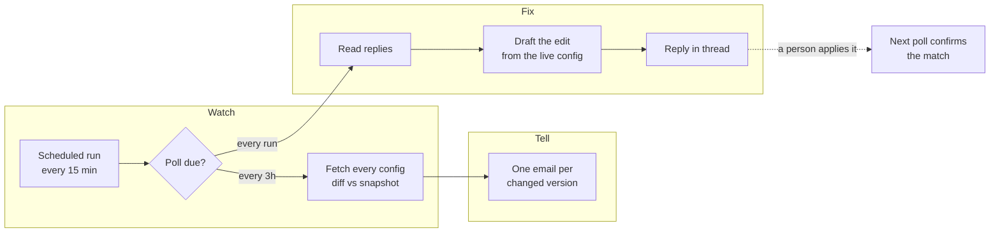
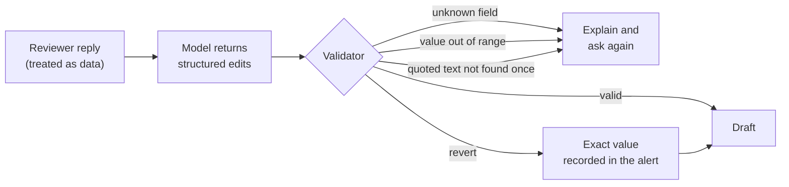
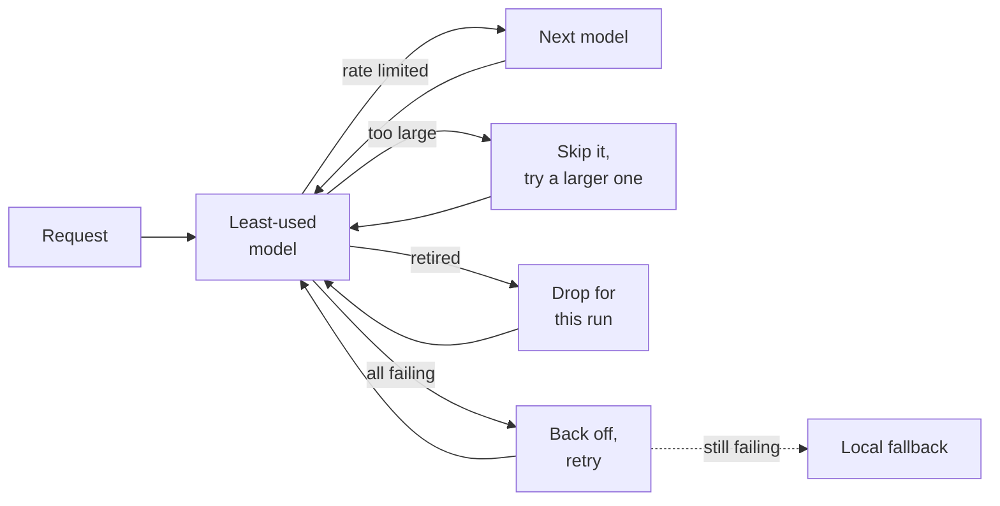

<div align="center">

# VertexWatch

**Change control for the prompts behind an OCR pipeline.**

Every config change is caught, explained, and fixable from a single email reply.


<br/>

| 5 | 15 min | 1 | 0 |
|:---:|:---:|:---:|:---:|
| environments watched | reply check interval | email per changed version | changes applied without a human |

</div>

---

## The problem

An OCR pipeline is only as good as the prompt and model settings behind it. One edited sentence in a system instruction, or a temperature nudged from 0.2 to 0.9, quietly changes how every document is read. Nobody gets told, and by the time extraction quality drops, nobody remembers what changed.

Rolling a bad change back used to mean opening an admin panel, finding the right config, and hand-editing a prompt thousands of characters long.

## The approach

VertexWatch treats config drift the way code review treats commits. Every change becomes a thread, and the thread is where it gets fixed.

```text
 [VertexWatch][PROD] Config #42 | INVOICE | v7 | MODIFIED
 ┃ AI summary: dates are now normalised to ISO; the GSTIN rule was removed.
 ┃ before / after, highlighted at phrase level
 ┃
 ┣━ Reviewer     Put the GSTIN rule back and set temperature to 0.2.
 ┣━ VertexWatch  Draft v1  ·  current vs proposed  ·  JSON ready to paste
 ┣━ Reviewer     Keep the temperature as it is.
 ┣━ VertexWatch  Draft v2  ·  changes from v1: temperature dropped
 ┃
 ┗━ VertexWatch  Applied: full match ✓
```

No dashboard to log into and no new tool to learn. The inbox the team already watches becomes the control panel.

---

## How it works



| Stage | What happens |
|---|---|
| **Detect** | Each config is reduced to the fields that shape extraction (instructions, model, generation settings) and diffed against the last snapshot. |
| **Explain** | Prompt changes get a short plain-English summary and a phrase-level highlighted diff, not a raw wall of text. |
| **Draft** | A reply in plain English becomes a validated, numbered draft with exact values and a paste-ready JSON block. |
| **Refine** | Every further reply produces the next draft, showing exactly what moved since the last one. |
| **Close the loop** | Once the change lands, the next poll reports a full match, a partial match, or a change that went another way. |

---

## Engineering decisions

### The model proposes. The code decides.

The language model never writes into a draft directly. It returns a small structured schema, and every proposed change is validated against the live config before a reviewer sees it.



- **Reverts are never guessed.** "Undo it" restores the before-value captured when the change was detected.
- **Long prompts change surgically.** Edits must quote text that appears exactly once in the live prompt. A whole-prompt rewrite from a trimmed copy is refused, so a draft can never silently drop half a prompt.
- **Reply text is data, not instructions.** Only the configured reviewers are acted on, auto-replies are skipped, and quoted history and signatures are stripped before anything reaches the model.
- **Ambiguity gets a question, not a guess.** Unclear requests get one clarifying question back.

### Resilient to flaky AI



The model pool is discovered from the provider account on every run, so new models join and retired ones drop out with no code change. If every model is down, alerts still go out with a locally computed diff. AI improves the alert, but the alert never depends on it.

---

## Edge cases, handled

<details open>
<summary><b>Delivery and state</b></summary>

| Situation | Behaviour |
|---|---|
| One alert fails to send | Only that config's snapshot is held back, so it is retried on the next poll and nothing else is blocked |
| A single config fetch times out | Its last known version is kept, so a network blip is never reported as a deletion |
| The run crashes midway | State is saved even on failure, so nothing is lost and nothing is sent twice |
| A reply is handled | It is recorded only after the answer has actually gone out |
| Dozens of versions change at once | Each still gets its own email, plus one digest listing them all |
| A config is deleted | It is alerted, but no reply thread is opened, because there is nothing left to edit |

</details>

<details open>
<summary><b>Email in the real world</b></summary>

| Situation | Behaviour |
|---|---|
| Gmail and Outlook quoting styles | The reviewer's own words are extracted and quoted history is dropped |
| HTML-only replies and Windows line endings | Normalised before parsing |
| Out-of-office and auto-replies | Ignored |
| Someone outside the reviewer list replies | Ignored |
| A long back-and-forth | Every answer stays in the same thread, and drafts are capped per thread |

</details>

<details open>
<summary><b>AI output</b></summary>

| Situation | Behaviour |
|---|---|
| Model returns malformed JSON | Retried on another model, then the reviewer is asked to rephrase |
| Model rewords text while highlighting it | Rejected, and an exact local diff is shown instead |
| Model unavailable for a while | The reply is retried on later runs, and the thread is told plainly if it still cannot be processed |
| Drafting against production | Every draft carries an "apply only after review" banner |

</details>

---

## Under the hood

```text
monitor.py                  detection, alerting, reply drafting, model pool
.github/workflows/main.yml  one parallel job per environment, on a schedule
requirements.txt            a single dependency; the rest is the standard library
```

- Runs entirely on **GitHub Actions**, with no server to host. State lives in the Actions cache between runs.
- **SMTP and IMAP** over one mailbox, threaded with standard `Message-ID` / `In-Reply-To` headers so mail clients keep each conversation together.
- Credentials are read from repository secrets and never logged.
- The tunable settings (poll interval, draft limit, value ranges, prompt budgets) sit as named constants at the top of `monitor.py`.

<div align="center">
<br/>

**Catch the change. Understand it. Fix it from your inbox.**

</div>
