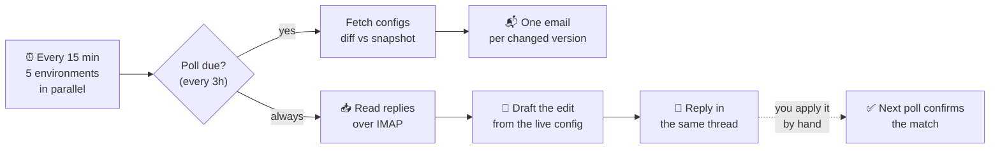
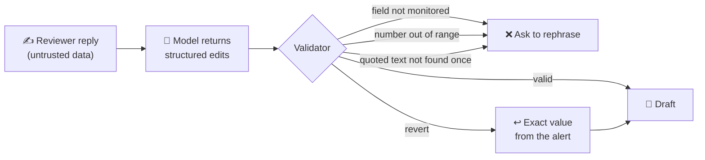
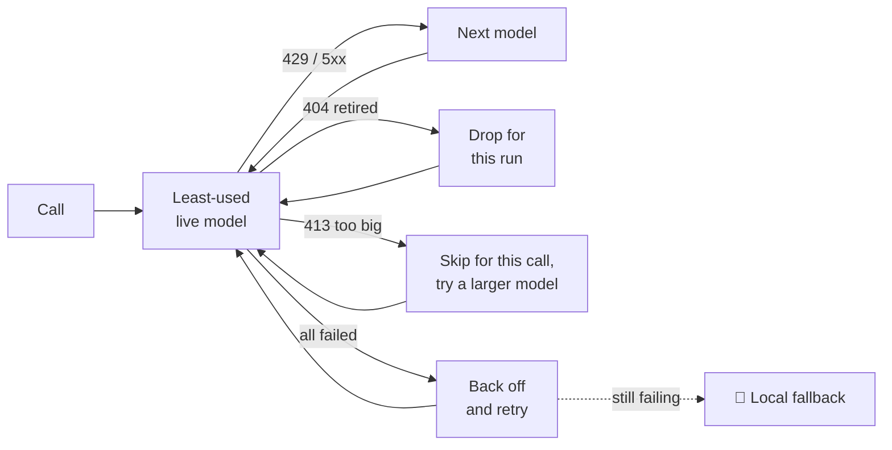

<div align="center">

# 🔭 VertexWatch

### Every prompt change, caught. Every fix, one email reply away.

**VertexWatch watches the Vertex AI OCR configs behind five environments, explains every change in plain English, and turns your email replies into ready-to-apply config edits.**


</div>

---

## 💥 The problem

OCR extraction quality lives and dies by a handful of config fields: a system prompt, a temperature, a token budget. When one of them changes silently in production, invoices start parsing wrong and nobody knows why.

And when someone *does* spot a bad change, fixing it means opening an admin panel, finding the config, and hand-editing a prompt that runs to thousands of characters.

## ✨ The idea

> **Make the alert email the control panel.**

VertexWatch emails you the moment a config version changes. You reply in plain words. It replies back with the exact edit, validated against the live config, ready to paste. You stay in charge of applying it.

```text
 📬  [VertexWatch][PROD] Config #42 | INVOICE | v7 | MODIFIED
     🤖 "Dates are now normalised to ISO; the GSTIN rule was removed."

 ✍️  You:          "Put the GSTIN rule back and set temperature to 0.2"

 📝  VertexWatch:  Draft v1 · current vs proposed · copy-ready JSON

 ✍️  You:          "Keep temperature as it is"

 📝  VertexWatch:  Draft v2 · changes from v1: temperature dropped

 ✅  Next poll:    "Applied: full match"
```

---

## 🧭 How it works



| | What happens | Why it matters |
|---|---|---|
| 🔍 **Detect** | Every config is flattened to its critical fields and diffed against the last snapshot. | Catches prompt, model and generation-setting drift across `dev`, `sandbox`, `jkc-uat`, `jkc-prod`, `prod`. |
| 📬 **Alert** | One email per changed version, each its own thread, with an AI summary and a highlighted before/after. | One topic per email, so a reply is never ambiguous. |
| 🧠 **Draft** | Your reply plus the live config go to the model pool, which returns structured edits, not prose. | You get exact field values and a JSON block, not advice. |
| 🔁 **Refine** | Every reply produces Draft v2, v3… with a summary of what moved. | Back-and-forth over email until it is right. |
| ✅ **Confirm** | When the change lands, the next poll compares it with the draft. | Full match, partial match, or a heads-up that something else changed. |

---

## 🧠 The logic that makes it trustworthy

### 1. The model proposes, the code decides

The LLM never writes free text into a draft. It returns a small JSON schema, and every proposed change is checked before anyone sees it.



- **Reverts are never guessed.** "Undo it" restores the exact before-value captured in the alert.
- **Long prompts change surgically.** Edits must quote text that appears exactly once in the live prompt, so a model that only saw a trimmed copy can never truncate it.
- **Replies are data, not instructions.** Only addresses in `ALERT_EMAIL` count, auto-replies are ignored, and the prompt tells the model to ignore instructions hidden in a reply.
- **Production gets a banner.** `prod` and `jkc-prod` drafts say *apply only after review*.

### 2. A model pool that does not fall over

Free-tier LLMs rate-limit hard. VertexWatch treats every model on the Groq account as a separate bucket and routes around trouble.



The pool is discovered from the account at the start of each run, so new models join and retired ones drop out without a code change. If AI is unavailable, alerts still go out with a local character-level diff.

### 3. An alert is never lost, never doubled

- A config's snapshot only advances after **its own** email is sent. A failed send is retried on the next poll.
- A fetch that fails for one config keeps its last snapshot, so a network blip is never reported as a deletion.
- Snapshot and reply state live in GitHub Actions caches, saved even when a run fails.
- Model-generated highlights are only used if their text matches the source exactly. Otherwise the local diff is shown.

---

## 🚀 Get it running

1. **Secrets.** Add these under *Settings → Secrets and variables → Actions*:

   | Secret | Purpose |
   |---|---|
   | `DEV_*`, `SANDBOX_*`, `JKC_*`, `PROD_*` | API username / password per environment |
   | `GMAIL_USER`, `GMAIL_APP_PASS` | Sender inbox (a Gmail App Password) |
   | `ALERT_EMAIL` | Comma-separated recipients, also the reviewers allowed to request drafts |
   | `GROQ_API_KEY` | Optional. Enables summaries, highlights and drafts |

2. **Enable IMAP** on the `GMAIL_USER` account (Gmail Settings → Forwarding and POP/IMAP), so replies can be read.
3. **Run it.** The workflow runs every 15 minutes on its own. *Actions → VertexWatch → Run workflow* forces a full poll now.

> 💡 The first poll for each environment saves a baseline. Alerts start from the second poll on.

---

## 🗂️ What is inside

```text
monitor.py                  Detection, alert emails, reply drafting, Groq model pool
.github/workflows/main.yml  One matrix job per environment, every 15 minutes
requirements.txt            requests (everything else is the standard library)
```

Tunables (poll interval, draft limit, value ranges, prompt budgets) sit at the top of `monitor.py`.

<div align="center">

**Watches the configs. Writes the fix. Leaves the final call to you.** 🔭

</div>
