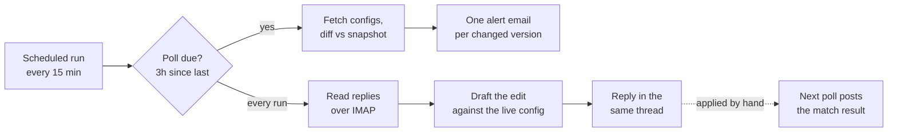
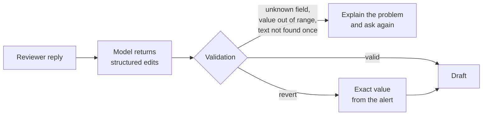

# VertexWatch

VertexWatch watches the Vertex AI OCR configs across our five environments and tells us, by email, the moment one of them changes. If a change looks wrong, you reply to that email in plain English and VertexWatch replies with the exact edit to make. It never writes to an environment itself. A person always applies the change.

| Environment | Backend |
|---|---|
| `dev` | EKA API (dev) |
| `sandbox` | EKA API (UAT sandbox) |
| `jkc-uat` | JK Systems UAT |
| `jkc-prod` | JK Systems Production |
| `prod` | EKA Production (Heimdall) |

## Why it exists

Extraction quality depends on a few config fields: the system and user instructions, the model, and the generation settings. A small edit to any of them can change how every invoice is read, and before this there was no record of who changed what or when.

Fixing a bad change was also slow. Someone had to open the admin panel, find the config and hand-edit a prompt that can run to thousands of characters. VertexWatch moves that loop into the alert email itself.

## What a change looks like

```text
[VertexWatch][PROD] Config #42 | INVOICE | v7 | MODIFIED
    Summary: dates are now normalised to ISO; the GSTIN rule was removed.

Reviewer:     Put the GSTIN rule back and set temperature to 0.2.
VertexWatch:  Draft v1, current vs proposed, plus JSON to paste.

Reviewer:     Keep the temperature as it is.
VertexWatch:  Draft v2. Changes from v1: temperature dropped.

(the reviewer applies it in the admin panel)

VertexWatch:  Applied: full match.
```

## How it works



Each run is a GitHub Actions matrix job, one per environment, running in parallel.

1. **Detect.** Every config is reduced to the fields that matter and compared with the last saved snapshot.
2. **Alert.** Each changed version gets its own email, and so its own thread. A change to `systemInstruction` comes with a short AI summary and a highlighted before and after.
3. **Draft.** Replies from people on `ALERT_EMAIL` are read over IMAP. The reply and the live config go to a language model, which must answer with structured edits rather than prose. The edits are validated and sent back as a numbered draft.
4. **Refine.** Each further reply produces the next draft, with a note of what moved since the last one.
5. **Confirm.** When the config changes again, the next poll compares it with the open draft and reports a full match, a partial match, or a change that did not follow the draft.

## How the drafts are kept safe

The model only proposes. Nothing it returns reaches a reviewer until the code has checked it.



- Only the monitored fields can be drafted, and numbers are range-checked (temperature 0 to 2, topP 0 to 1, and so on).
- "Revert" restores the before-value recorded in the alert. The model is never asked to remember it.
- Long instructions are only changed through find-and-replace edits whose text must appear exactly once in the live prompt. The model sees a trimmed copy of a long prompt, so a whole-text rewrite is refused rather than risking a truncated prompt.
- Reply text is treated as data. Only addresses in `ALERT_EMAIL` are acted on, auto-replies are skipped, and quoted history and signatures are stripped before anything reaches the model.
- Drafts for `prod` and `jkc-prod` carry an "apply only after review" banner, and every draft warns if the live config has moved since the alert.
- Ambiguous requests get one clarifying question instead of a guess. A thread allows up to five drafts.

## Edge cases it handles

- **A failed send is retried, not lost.** A config's snapshot only advances once its own alert has been sent, so one failed email doesn't hold back the others or get skipped.
- **A network blip is not a deletion.** If one config fails to fetch, its last known version is kept for that poll instead of being reported as removed.
- **Nothing is sent twice.** Snapshot and reply state are kept in GitHub Actions caches and saved even when a run fails. A reply is recorded as handled only after its answer has gone out.
- **Model outages.** Each model on the Groq account has its own rate limit, so calls move to the next model on a rate limit or server error. A model too small for a request is skipped for that call, and a retired model is dropped for the run. If every model fails, alerts still go out with a local diff, and a reply is retried on later runs, then answered with a clear message after four attempts.
- **Model output is checked, not trusted.** A highlighted diff is only used if its text matches the source exactly; otherwise the local diff is shown.
- **Real email clients.** Gmail and Outlook quote formats, CRLF line endings and HTML-only replies are all handled when extracting what the reviewer wrote.
- **Bulk changes.** A run that finds more than ten changed versions also sends a one-line-per-version digest.
- **Removed configs.** A removal is alerted, but it opens no reply thread, since there is nothing left to draft against.

## Setup

1. Add these repository secrets under Settings, Secrets and variables, Actions:

   | Secret | Purpose |
   |---|---|
   | `DEV_USERNAME`, `DEV_PASSWORD` | dev API login |
   | `SANDBOX_USERNAME`, `SANDBOX_PASSWORD` | sandbox API login |
   | `JKC_USERNAME`, `JKC_UAT_PASSWORD`, `JKC_PROD_PASSWORD` | JK Systems logins |
   | `PROD_USERNAME`, `PROD_PASSWORD` | production API login |
   | `GMAIL_USER`, `GMAIL_APP_PASS` | sending and reading inbox (Gmail App Password) |
   | `ALERT_EMAIL` | comma-separated recipients, who are also the people allowed to request drafts |
   | `GROQ_API_KEY` | optional; without it alerts still work, but there are no summaries or drafts |

2. Turn on IMAP for the `GMAIL_USER` account (Gmail Settings, Forwarding and POP/IMAP) so replies can be read.
3. The workflow then runs every 15 minutes on its own. To force a poll now, use Actions, VertexWatch, Run workflow.

The first poll for each environment only saves a baseline. Alerts start from the next one.

## Project layout

```text
monitor.py                  detection, alerts, reply drafting and the Groq model pool
.github/workflows/main.yml  one matrix job per environment, every 15 minutes
requirements.txt            requests; everything else is the Python standard library
```

Tunable values, such as the poll interval, draft limit, value ranges and prompt sizes, are constants at the top of `monitor.py`.
